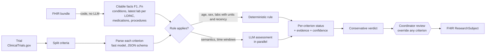

# trial-matcher

**Clinical trial pre-screening from a patient's FHIR record.** A FHIR R4 bundle and a ClinicalTrials.gov
study go in. Out comes a status for every eligibility criterion (met, not met, unknown) with the FHIR
resources it rests on, a calibrated confidence, a conservative overall verdict, and a FHIR `ResearchSubject`
that stays `candidate` until a study coordinator has reviewed it.



## Design decisions

| Decision | Reason |
| --- | --- |
| Numbers are checked by code, not by the LLM | Lab thresholds and age are where a model error is most dangerous and easiest to avoid |
| Labs older than 12 months give "unknown" | Trials need values at screening; an old HbA1c should trigger a new test, not a guess |
| Unit mismatches go to the model or a human | mmol/mol versus % for HbA1c is a classic silent error |
| "Not found in the record" is capped at 0.6 confidence | Absence of evidence is not evidence of absence, especially in fragmented records |
| "Eligible" needs every inclusion met and every exclusion not met | Borderline patients go to a human rather than being dropped or enrolled |
| Every decision cites FHIR references | Auditable: a coordinator can go from the decision to the resource |
| Calibration is measured | A confidence of 0.9 is only useful if the system is right about 90% of the time at 0.9 |

## Quick start

No GPU needed. Python 3.11 to 3.13.

```bash
python -m venv .venv && source .venv/bin/activate
pip install -e ".[dev]"
cp .env.example .env                       # API key for an OpenAI-compatible endpoint
ctm facts src/trial_matcher/samples/patients/p1.json --as-of 2026-10-01   # what the agent can cite
ctm demo                                   # synthetic patient p1 against synthetic trial SYN-T2D-001
ctm demo --patient p3 --trial SYN-CKD-002
pytest                                     # offline tests with scripted model responses
```

Real trials and your own patients:

```bash
ctm match patient_bundle.json NCT0XXXXXXX            # fetches the trial, then pauses for review
ctm match patient_bundle.json trial.json --no-review --as-of 2026-10-01
```

During review you can override any criterion, for example `8 met starts insulin next week`. The override is
stored with the reviewer and time, the verdict is recomputed, and `ResearchSubject.status` becomes `eligible`
or `ineligible`, or stays `candidate`.

Outputs in `runs/latest/`: `report.md` (a table per criterion), `result.json`, `facts.json`,
`research_subject_bundle.json`.

## How a criterion is decided

1. **Facts.** The FHIR bundle is flattened into numbered facts in code: active conditions, the latest
   observation per LOINC code (with components and units), medication statements and requests (dose text built
   from `doseAndRate`, references resolved), procedures and allergies. Facts are ordered newest and active
   first and de-duplicated.
2. **Parsing.** Criteria text is split into single criteria (handling "Key Inclusion Criteria" headings and
   nested "one of the following" lists). A fast model turns each into a category, threshold, unit and synonyms.
3. **Rules.** Age, sex, simple lab thresholds (with unit and recency checks) and pregnancy criteria for male patients are decided in code.
   Compound lab criteria ("A or B") go to the model.
4. **Model.** Everything else is assessed by the model against the cited facts, in parallel, with guided JSON.
5. **Aggregation.** A conservative verdict: `eligible`, `ineligible` or `needs_review`.

## Synthetic data

- `src/trial_matcher/samples/`: three hand-designed FHIR patients and two synthetic trials in which every
  criterion has a known answer, including deliberate traps (a stale HbA1c, a stopped medication, a recent
  myocardial infarction, a missing urine albumin test). Regenerate with `python scripts/make_samples.py`.
- Volume testing with Synthea: `bash scripts/get_synthea.sh 50` (Java 17+), then run `ctm facts` or
  `ctm match` on files in `synthea/output/fhir/`.

## Evaluation

```bash
ctm eval                                 # bundled labels: 6 patient-trial pairs, 51 labelled criteria
ctm eval --labels my_labels.jsonl        # your own set, same JSONL format (see evaluate.py)
```

Reported: criterion accuracy, accuracy when the system commits (not "unknown"), coverage, per-class
precision, recall and F1, accuracy by method (rule versus model), trial-level verdict accuracy and confusion
matrix, and calibration (expected calibration error with a reliability table). The unit tests use scripted
model answers, so their scores say nothing about model quality; run `ctm eval` against a real endpoint for that.

A practical way to grow the labelled set: run `ctm match` on Synthea patients against real trials, correct
statuses during review, and save them in the label format. Public benchmarks to compare against: TREC
Clinical Trials (2021 to 2023 topics) and n2c2 2018 cohort selection (data use agreement required).

## NeMo Agent Toolkit

The matcher is registered as a NeMo Agent Toolkit component, so it can be run, profiled and served as a tool:

```bash
pip install -e ".[nat]"
nat run --config_file configs/workflow.yml \
  --input "src/trial_matcher/samples/patients/p1.json | src/trial_matcher/samples/trials/SYN-T2D-001.json | 2026-10-01"
nat mcp serve --config_file configs/workflow.yml     # pre-screening as an MCP tool for other agents
```

## Configuration

Settings come from environment variables or `.env` (see `.env.example`): `NIM_BASE_URL` (any
OpenAI-compatible endpoint, hosted or self-hosted), `NVIDIA_API_KEY`, `CTM_MODEL_FAST` (used for
parsing and assessment), `CTM_TEMPERATURE`, `CTM_MAX_TOKENS`. `ctm models` lists the model IDs your endpoint serves.

## Project layout

```
src/trial_matcher/
  fhir_facts.py      FHIR bundle -> numbered, citable facts
  trials.py          ClinicalTrials.gov loading and criteria parsing
  rules.py           deterministic checks: age, sex, labs with units and recency, pregnancy (male)
  matcher.py         LangGraph workflow: parse, assess (rules or model), aggregate, review
  fhir_out.py        FHIR ResearchStudy and ResearchSubject output
  evaluate.py        accuracy, F1, verdict confusion, calibration
  llm.py, config.py  OpenAI-compatible client with guided JSON; settings
  nat_plugin/        NeMo Agent Toolkit component
  samples/           synthetic patients, trials and labels
scripts/             sample generator, Synthea download
tests/               offline tests
```

> **Design note.** The small OpenAI-compatible client (`llm.py`) and settings (`config.py`) are intentionally vendored rather than shared as a package, so each example is self-contained and runs with a single `pip install`. The same module appears in the sibling projects by design.

## Development

```bash
pip install -e ".[dev]"
ruff check . && ruff format --check .
pytest
```

## Limitations

- A research prototype, not a medical device. A coordinator and investigator confirm eligibility.
- Synthetic data only in this repository.
- Complex criterion logic can still need a human; trials with more than 60 criteria are truncated and flagged.
- Unit conversion is not implemented; mismatches go to the model or a reviewer.

## Licence

Apache-2.0 (see `LICENSE`). ClinicalTrials.gov data is public; Synthea is Apache-2.0.
